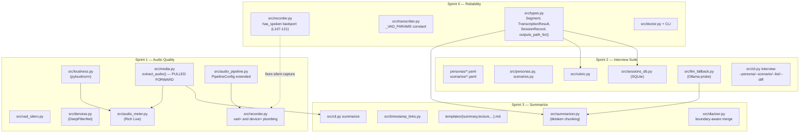

# Spooknix — Roadmap to State-of-the-Art Audio (4 Sprints)

## Context

The user is preparing for a battery of professional interviews and video work, and wants to evolve Spooknix from "promising prototype" into a **top-tier audio platform** — privacy-first, on-device, no compromise on quality. Today the project ships an interview orchestrator and STT server, but is unreliable (intermittent silent captures — see `sound.txt`: 2.1 s capture → empty transcription) and lacks the production polish for a "battery of interviews" or for digesting hours of lecture/video content.

**Verified current state** (read from `/home/user/repo`, 2026-05-14):

- `src/recorder.py:107-121` — early-stop bug confirmed: `silent_count` accumulates from frame 0 with no `has_spoken` guard. The orchestrator at `src/orchestrator.py:369-377` already has the right pattern (`has_spoken = False`, gate stop on it); needs to be backported.
- VAD inconsistency: `src/transcriber.py:71-74` (`transcribe_file`) passes `vad_parameters=dict(min_silence_duration_ms=500, threshold=0.4)`; `transcribe_stream` at `src/transcriber.py:145-154` passes only `vad_filter=True` (faster-whisper default threshold ≈ 0.5).
- Persona/scenario hardcoded in `src/cli.py:581-593` (Sarah + System Design, Standard, 15 min).
- `src/llm_client.py:35-40` raises when `OPENAI_API_KEY` is missing and no `LLM_BASE_URL` is set → matches the OpenAI 401 observed in `outputs/interviews/session.md`.
- No `summarize` command. `src/cli.py file` (line 78-153) routes `.mp4`/`.mkv` through faster-whisper's internal ffmpeg but never extracts audio explicitly.
- 65 test functions across 10 files in `tests/` currently passing under `nix develop -c pytest`.
- Logging infrastructure (`src/logging_setup.py`) and eBPF tracer (`scripts/ebpf-audio-debug.bt`) already shipped.
- `templates/` ships `evaluator.md` and `interviewer.md` only.

**User decisions (confirmed):**

- Focus: all 4 pillars (quality, interview suite, summarize, reliability).
- Deps: top-tier without ceremony (DeepFilterNet, Silero VAD, pyannote 3.1, WhisperX allowed).
- Delivery: sequential sprints.

---

## Sprint shape & dependencies



Reading the diagram: solid arrows are hard data dependencies (`src/types.py` is imported by Sprints 2 and 3; `src/media.py` was pulled from Sprint 3 into Sprint 1 so audio-meter tests can replay video clips; `src/llm_fallback.py` lands in Sprint 2 but unblocks both interview and summarize LLM calls). Dotted arrow shows that the recorder bug-fix conceptually flows into the Sprint 1 recorder refactor.

---

## Sprint 0 — Reliability foundation

**Goal:** nothing in the recording path can fail intermittently; `doctor` catches setup issues before they hit the user.

**Modify**

- `/home/user/repo/src/recorder.py:80, 107-121` — add `has_spoken = False` next to `silent_count`; set `has_spoken = True` in the `if is_speech:` branch; gate the stop condition `if n > silent_chunks_needed and silent_count >= silent_chunks_needed:` on `has_spoken`. Mirror the orchestrator pattern at `src/orchestrator.py:369-377`.
- `/home/user/repo/src/transcriber.py` — lift `vad_parameters` (currently inline at L71-74) to module-level `_VAD_PARAMS = dict(min_silence_duration_ms=500, threshold=0.4)`; pass `vad_parameters=_VAD_PARAMS` in both `transcribe_file` (L64-76) and `transcribe_stream` (L145-154).
- `/home/user/repo/src/cli.py` — audit `-v/-vv` is declared on every subcommand. `file` (L78) and `info` (L39) are missing the flag; `record`/`stream`/`interview` already have it.

**Create**

- `/home/user/repo/src/types.py` — canonical dataclasses consumed by Sprints 2 & 3:
  - `Segment(start, end, text, words, speaker, avg_confidence)`
  - `TranscriptionResult(text, segments, language, duration)`
  - `SessionRecord(id, ts, persona, scenario, difficulty, duration_s, audio_path, transcript_path, rubric, notes)`
  - `outputs_path_for(session_id) -> Path` returning `outputs/interviews/<ts>-<persona>/`
- `/home/user/repo/src/doctor.py` + CLI command `spooknix doctor` — checks: CUDA via `torch.cuda.is_available()`, server `/health` via `urllib`, `sd.query_devices()`, 1 s mic baseline RMS, `shutil.which("ffmpeg")`, Ollama probe at `http://localhost:11434/api/tags`. Renders Rich table; suggests the recommended `--device` index.
- `/home/user/repo/tests/test_recorder_has_spoken.py` — uses the existing `_make_mock_sd` fixture in `tests/test_recorder.py:22-62`. Extend the fixture (or write a sibling `_make_mock_sd_seq`) so the first N chunks are silence and only then comes speech; assert the recording did NOT stop in the first 2 s of silence.
- `/home/user/repo/tests/test_vad_consistency.py` — assert `transcribe_file` and `transcribe_stream` both reference the same `_VAD_PARAMS` object.
- `/home/user/repo/tests/test_doctor.py` — mock `sd.query_devices`, `torch.cuda`, `urllib.request.urlopen`; assert the table renders without errors and detects missing-ffmpeg case.

**Reuse**

- `src/orchestrator.py:369-377` — `has_spoken` pattern.
- `tests/test_recorder.py:22-62` — `_make_mock_sd` fixture (needs extension for silence-then-speech sequencing).
- `src/llm_client.py:31-46` — env-var detection pattern (for doctor's LLM probe).

**Deps:** none new.

**Risk:** the current `_make_mock_sd` injects all speech chunks first, then all silence chunks. The regression test needs the inverse order, so the fixture must be parameterised before authoring the test.

---

## Sprint 1 — Top-tier audio quality

**Goal:** the cleanest possible signal reaches Whisper. Replace the RMS heuristics with industry-standard primitives.

**Create**

- `/home/user/repo/src/vad_silero.py` — wraps `silero-vad` (torchaudio). `SileroVAD.is_speech(chunk: np.ndarray) -> bool` with 30 ms window + sticky hangover; discard first 200 ms (warm-up).
- `/home/user/repo/src/denoise.py` — `DeepFilterNetDenoiser` loads `df-3` once. Frame-by-frame (480-sample / 30 ms hops) for real-time; full-buffer call for `transcribe_file`. Internal 48 kHz; resample via `torchaudio.functional.resample`.
- `/home/user/repo/src/loudness.py` — `pyloudnorm.Meter` wrapper. `to_lufs(audio, sr, target=-23.0)`; guard buffers shorter than 0.4 s (Meter block size).
- `/home/user/repo/src/audio_meter.py` — Rich `Live` widget: peak (dBFS), RMS, integrated LUFS, sparkline waveform.
- `/home/user/repo/src/alignment.py` — optional WhisperX wrapper, gated behind `try/except ImportError` and `WHISPERX_DISABLED=1` env var (pyannote version conflicts).
- `/home/user/repo/src/media.py` — **pulled forward from Sprint 3.** `extract_audio(input_path) -> Path` via `ffmpeg-python` (16 kHz mono PCM WAV to tmp). ~30 lines; needed so Sprint 1 device + meter tests can replay video clips.
- Tests: `test_vad_silero.py`, `test_denoise.py`, `test_loudness.py`, `test_pipeline_order.py`, `test_audio_meter.py`. Deterministic synthetic signals (sine + AWGN); assert SNR improves after denoise (e.g. ≥10 dB on a –10 dB SNR input), LUFS error < 0.5 dB.

**Modify**

- `/home/user/repo/src/audio_pipeline.py:19-24` — extend `PipelineConfig` with `denoise: bool=True`, `lufs_normalize: bool=True`, `target_lufs: float=-23.0`, `pre_emphasis: bool=True`, `pre_emphasis_coef: float=0.97`. In `_apply` (L48-64): high-pass → denoise → pre-emphasis (`audio[1:] -= coef*audio[:-1]`) → LUFS → clip. When LUFS is on, skip the RMS-normalize branch (L56-59).
- `/home/user/repo/src/recorder.py` — accept `vad: SileroVAD | None`; when provided, replace the RMS logic at L107-113. Add `device: int | None` plumbed to `sd.InputStream(device=...)` at L163.
- `/home/user/repo/src/transcriber.py:14` — add `"large-v3-turbo"` to `SUPPORTED_MODELS`; `_compute_type` treats turbo like large-v3. Also update the `click.Choice` list in `src/cli.py:67-69`.
- `/home/user/repo/src/cli.py record` (L180) — flags: `--device`, `--no-denoise`, `--no-vad-neural`, `--meter`. Mount `AudioMeter` as `Live` when `--meter`.
- `/home/user/repo/src/doctor.py` — list devices and emit the recommended `--device` value.

**Deps**

- Nix (`flake.nix:80-115`): add `python313Packages.torchaudio`, `python313Packages.pyannote-audio` (already in diarization group, surface to dev shell).
- Poetry (`pyproject.toml`): new optional group `audio-quality`: `silero-vad ^5.1`, `deepfilternet ^0.5`, `pyloudnorm ^0.1.1`, `whisperx ^3.1` (optional), `ffmpeg-python ^0.2`.

**Risks**

- DeepFilterNet's "30 ms" only holds on GPU — benchmark on the RTX 3050; allow opt-out via `--no-denoise`.
- WhisperX pins old `transformers`/`pyannote` — keep optional, gate import.
- Silero VAD non-deterministic on first chunk — drop warm-up frames.

---

## Sprint 2 — Interview suite complete

**Goal:** run a battery of mocks with persona/scenario variation, persisted history, structured scoring.

**Create**

- `/home/user/repo/personas/sarah.yaml`, `marcus.yaml`, `priya.yaml`, … schema: `name`, `system_prompt`, `voice_ref_audio`, `voice_ref_text`, `style`, `language`.
- `/home/user/repo/scenarios/{behavioral,system_design,frontend,backend,ml,leadership,product}.yaml` — schema: `interview_type`, `target_role`, `difficulty_levels.{easy,standard,hard}` each with `duration_mins`, `prompt_addendum`, `rubric_weights`.
- `/home/user/repo/src/personas.py` — `load_persona(name) -> Persona`, `list_personas()`; reuses `src/orchestrator.py:35-40` `Persona`.
- `/home/user/repo/src/scenarios.py` — `load_scenario(name, difficulty) -> Scenario`; reuses `src/orchestrator.py:42-47` `Scenario`.
- `/home/user/repo/src/sessions_db.py` — SQLite at `~/.local/share/spooknix/sessions.db`, schema: `sessions(id PK, ts, persona, scenario, difficulty, duration_s, audio_path, transcript_path, rubric_json, notes)`. Migrations via `PRAGMA user_version`.
- `/home/user/repo/src/rubric.py` — `Rubric` dataclass (communication, technical_depth, confidence, clarity, examples — each `{score:int, comment:str}`); parser with JSON-fenced fallback (regex-extract after free-form generation, then retry on parse failure).
- `/home/user/repo/src/llm_fallback.py` — probe Ollama at `http://localhost:11434/api/tags`; if reachable, return `LLMClient(base_url="http://localhost:11434/v1", model="qwen2.5:7b-instruct")`.
- `/home/user/repo/templates/evaluator_rubric.md` — instructs JSON-only output of the 5-axis rubric.
- Tests: `test_personas_yaml.py`, `test_scenarios_yaml.py`, `test_sessions_db.py`, `test_rubric_parser.py`, `test_llm_fallback.py`, `test_cli_interview_flags.py`.

**Modify**

- `/home/user/repo/src/cli.py interview` (L517-633) — add `--persona`, `--scenario`, `--difficulty`, `--list`, `--show <id>`, `--diff <id1> <id2>`. Replace the hardcoded block at L581-593 with `load_persona(persona)` + `load_scenario(scenario, difficulty)`. Output dir: `outputs/interviews/<ts>-<persona>/` from `types.outputs_path_for`.
- `/home/user/repo/src/llm_client.py:31-46` — before raising the missing-key `ValueError`, call `llm_fallback.probe()`; if it returns a client, return that instead.
- `/home/user/repo/src/orchestrator.py:317-416` — accept `session_dir: Path`; persist `transcript.md`, `audio.wav`, `rubric.json` there.

**Deps**

- Poetry: `pyyaml ^6.0`. SQLite via stdlib.
- Nix: `python313Packages.pyyaml`.

**Risks**

- JSON-mode reliability varies by backend; always fall back to regex extraction + retry.
- `--diff` rendering: side-by-side scores in `rich.table.Table`, not a textual diff of full transcripts.

---

## Sprint 3 — Summarize videos/lectures

**Goal:** point Spooknix at any media file, get a structured summary with timestamp-linked references.

**Create**

- `/home/user/repo/src/summarizer.py` — `chunk_segments(segments, max_tokens=3000)` via `tiktoken`; `summarize_chunks(chunks, template)`; `stitch(summaries)`. Each chunk summary keeps `[mm:ss]` references.
- `/home/user/repo/src/timestamp_links.py` — `seconds_to_link(s, source_uri) -> "[12:34](source.mp4#t=754)"`.
- `/home/user/repo/templates/{summary,lecture,meeting,notes,study_guide}.md` — Jinja2 templates with sections (`{{ tldr }}`, `{{ chapters }}`, `{{ action_items }}`, `{{ key_quotes }}`).
- CLI command `spooknix summarize <input> --template <name> --format md|json|srt-summary --diarize --language pt`.
- Tests: `test_summarizer_chunking.py`, `test_timestamp_links.py`, `test_diarize_merge.py`, `test_summarize_e2e.py` (tiny model + 10 s synthetic audio).

**Modify**

- `/home/user/repo/src/transcriber.py:53-119` — document that `.mp4`/`.mkv` work via faster-whisper's internal ffmpeg; add explicit `extract_audio` pre-step when `--diarize` is on (diarizer needs WAV).
- `/home/user/repo/src/diarizer.py:71-102` — `assign_speakers` currently picks the single best-overlap speaker per Whisper segment; extend to split Whisper segments at diarization boundaries before merging, so a single utterance crossing two speakers becomes two segments.
- `/home/user/repo/src/cli.py file` (L78) — share the `extract_audio` helper from `src/media.py` (landed in Sprint 1).

**Deps**

- Poetry: `jinja2 ^3.1`, `tiktoken ^0.8`. `ffmpeg-python` already in via Sprint 1.
- Nix: `ffmpeg` already at `flake.nix:95`; add `python313Packages.jinja2`, `python313Packages.tiktoken`.

**Risks**

- Long videos: pass file paths to faster-whisper (it streams via ffmpeg); never load full audio into RAM (avoids the 230 MB/h problem from `record`).
- For local models, `tiktoken o200k_base` is approximate — use a conservative 3000-token cap.

---

## Test strategy

| Sprint | New test files | Style |
|---|---|---|
| 0 | `test_recorder_has_spoken`, `test_vad_consistency`, `test_doctor` | regression, property, mock |
| 1 | `test_vad_silero`, `test_denoise`, `test_loudness`, `test_pipeline_order`, `test_audio_meter` | synthetic-signal numeric assertions |
| 2 | `test_personas_yaml`, `test_scenarios_yaml`, `test_sessions_db`, `test_rubric_parser`, `test_llm_fallback`, `test_cli_interview_flags` | schema validation, SQLite roundtrip, mocked LLM |
| 3 | `test_summarizer_chunking`, `test_timestamp_links`, `test_diarize_merge`, `test_summarize_e2e` | token-count, integration with tiny model |

Mark GPU/slow tests with `@pytest.mark.gpu` (register in `pytest.ini`) so `pytest -m "not gpu"` stays the default CI path.

---

## Verification (end-to-end)

After each sprint, run under `nix develop`:

```bash
# Sprint 0
nix develop -c pytest tests/test_recorder_has_spoken.py tests/test_vad_consistency.py tests/test_doctor.py -v
nix develop -c spooknix doctor                          # Rich table, no red
nix develop -c spooknix record -vv                      # stay silent 5 s → must NOT stop

# Sprint 1
nix develop -c pytest -m "not gpu" tests/ -q
nix develop -c spooknix record --meter --device <idx>   # visual: peak/RMS/LUFS bar moves
nix develop -c spooknix file outputs/test.mp4           # via media.extract_audio

# Sprint 2
nix develop -c spooknix interview --persona sarah --scenario behavioral --difficulty hard
nix develop -c spooknix interview --list                # shows previous run
nix develop -c spooknix interview --diff 1 2            # side-by-side rubric

# Sprint 3
nix develop -c spooknix summarize lecture.mp4 --template lecture
nix develop -c spooknix summarize meeting.m4a --diarize --template meeting
```

---

## Critical files (modification surface)

- `/home/user/repo/src/recorder.py`
- `/home/user/repo/src/audio_pipeline.py`
- `/home/user/repo/src/transcriber.py`
- `/home/user/repo/src/cli.py`
- `/home/user/repo/src/orchestrator.py`
- `/home/user/repo/src/llm_client.py`
- `/home/user/repo/src/diarizer.py`
- `/home/user/repo/flake.nix`
- `/home/user/repo/pyproject.toml`

---

## What NOT to do

- No plugin/effects framework for the pipeline — `PipelineConfig` booleans are enough.
- No tuning loops on Silero/DeepFilterNet — trust pretrained defaults.
- No web UI for session diff in Sprint 2; Rich tables suffice.
- No LangChain/LlamaIndex for chunking — ~50 lines of `tiktoken` beats it on debuggability.
- Don't merge `transcribe_file` and `transcribe_stream` "for DRY" — their VAD config and callers differ.
- Drop WhisperX immediately if it conflicts with pyannote — faster-whisper's native `word_timestamps=True` is enough for `[mm:ss]` links.
